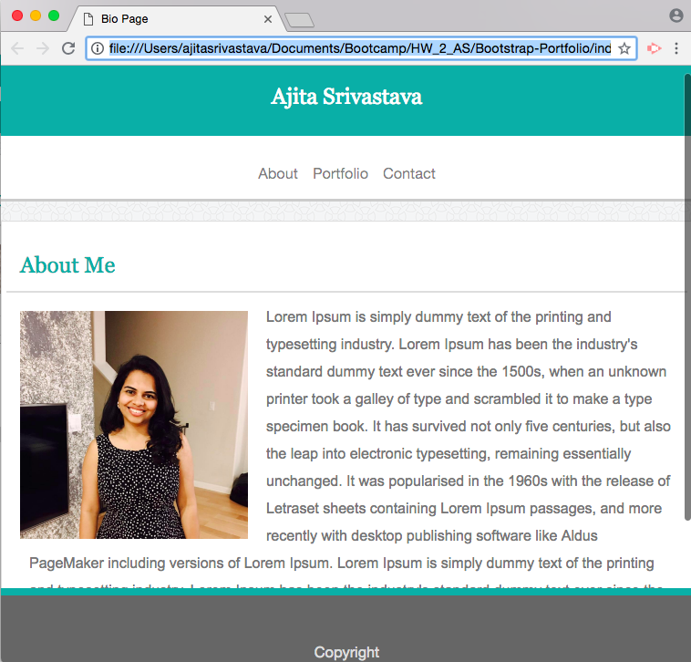

# Bootstrap-Portfolio

<!-- Put a description of what the project is -->
Learning Bootstrap: grid system, responsiveness, carousel, float, positioning, navbar

## Link to deployed site
<!-- make a link to the deployed site --> 
<!-- [What the user will see](the link to the deployed site) -->
[bootstrap-portfolio](https://ajitas.github.io/Bootstrap-Portfolio/)

## Images
<!-- take a picture of the image and add it into the readme  -->
<!--  -->


## technology used
<!-- make a list of technology used -->
<!-- what you used for this web app, like html css -->

<!-- 
1. First ordered list item
2. Another item
⋅⋅* Unordered sub-list. 
1. Actual numbers don't matter, just that it's a number
⋅⋅1. Ordered sub-list
4. And another item. 
-->
1. HTML
2. CSS
    * position
    * padding
    * pseudo classes
3. Bootstrap
    * float
    * grid laout
    * responsiveness
    * carousel
    * navbar


## code snippets
<!-- put snippets of code inside ``` ``` so it will look like code -->
<!-- if you want to put blockquotes use a > -->

```
<div class="container-fluid">
        <div class="row">
            <div class="col-md-2"></div>
            <div class="col-md-2 header">Ajita Srivastava</div>
            <div class="col-md-2"></div>
            <div class="col-md-6">
                <nav class="navbar navbar-expand-lg navbar-expand-md navbar-expand-sm navbar-expand-xl navbar-expand-xs navbar-light navlink">
                    <div class="mx-auto">
                        <ul class="nav navbar-nav">
                            <li class="nav-item">
                                <a class="nav-link" href="index.html">About</a>
                            </li>
                            <li class="nav-item">
                                <a class="nav-link" href="portfolio.html">Portfolio</a>
                            </li>
                            <li class="nav-item">
                                <a class="nav-link" href="contact.html">Contact</a>
                            </li>
                        </ul>
                    </div>
                </nav>
            </div>
        </div>
        <div class="row container1">
            <div class="col-md-2"></div>
            <div class="col-md-8 pagecontent">
                <div class="row">
                    <div class="col-md-12 contentheading">About Me</div>
                </div>
                <div class="row">
                    <div class="col-md-12 bio">
                        
                        <p id="biotext">Lorem Ipsum is simply dummy text of the printing and typesetting industry. Lorem Ipsum has been the industry's standard dummy text ever since the 1500s, when an unknown printer took a galley of type and scrambled it to make a type specimen book. It has survived not only five centuries, but also the leap into electronic typesetting, remaining essentially unchanged. It was popularised in the 1960s with the release of Letraset sheets containing Lorem Ipsum passages, and more recently with desktop publishing software like Aldus PageMaker including versions of Lorem Ipsum. Lorem Ipsum is simply dummy text of the printing and typesetting industry. Lorem Ipsum has been the industry's standard dummy text ever since the 1500s, when an unknown printer took a galley of type and scrambled it to make a type specimen book. It has survived not only five centuries, but also the leap into electronic typesetting, remaining essentially unchanged. It was popularised in the 1960s with the release of Letraset sheets containing Lorem Ipsum passages, and more recently with desktop publishing software like Aldus PageMaker including versions of Lorem Ipsum.</p>
                    </div>
                </div>
            </div>
            <div class="col-md-2"></div>
        </div>
        <div class="row">
            <div class="col-md-12 footer">Copyright</div>
        </div>
    </div>
```
## Learning points
* How a web page is made responsive with bootstrap
* Concept of grid layout
* Using navbar, carousel, form with bootstrap


## Author 
[Ajita Srivastava](https://github.com/ajitas)

## License
Standard MIT License
